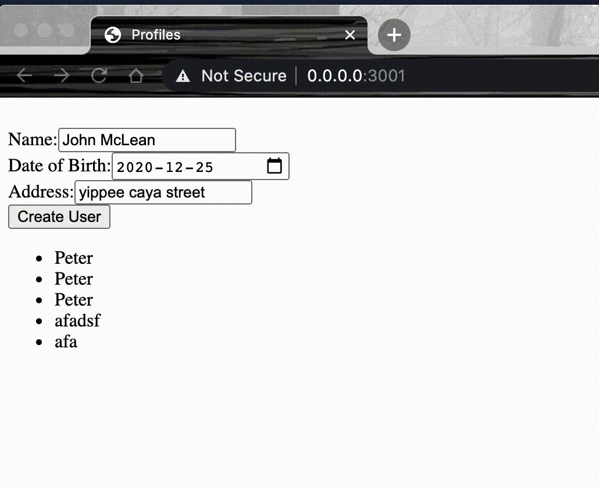

# Superformula Full Stack Developer Test

This is a modified version of the [superformula full stack developer test](https://github.com/Superformula/test-full-stack).

## Why a modified version?

I had around 4 ~ 5 hours to work on this challenge before the holidays. The original scopes
required tools such as Node.js, lambda, DynamoDB and HTML/CSS (without `material-ui` or the like).

I had limited exposure with these tools. Therefore, using them in this challenge could neither
allow me to be productive, nor showcase my current skillset.

Folks from SF (short for Superformula) were kind enough to allow me to cut some scopes.
Originally, I was supposed provide an initial write up of how I plan to code the API (without frontend).  I opted to provide the proposal along with finished code so I would not have to keep this on my mind througout the holidays. The rest of this document details the proposal and the implementaion.

# How to start

Dependencies:
- Docker
- docker-compose

To start the backend API server, run

```
docker-compose up
```

When you navigate to `http://0.0.0.0:8000/graphql`, you should see a GraphQL playground. This
is provided by `django-graphene` and is similar to the one provided by [Apollo](https://www.apollographql.com/docs/apollo-server/testing/graphql-playground/).

# Implementation

## API backend

I use Python + Django for the backend. I chose Django here because it
takes care of some tedious plumbing work such as environment variable management, admin
console, ORM and migrations.

To implement a GraphQL API, I use a Python library called [graphene](https://graphene-python.org/). As far as I know, there is no other reputable alternatives for Python.

The GQL schema is defined in [schema.py](core/graphql/schema.py) where queries and mutations are located. In a larger project, these can be split into multiple folders but that isn't neccessary for this challenge so I will keep them all in here.

### Code Structure

`UserProfile` model is defined in [models.py](core/models.py). When a field gets changed, addedor deleted, migrations can be generated and excuted.

I created a [UserRepository](core/respositories.py) for basic CRUD with the ORM.

### Queries and Mutations

[ListUsers](src/components/profiles/ListUsers.graphql) can list existing users and filter
them by name. The response is paginated. The total count, page number, page size are included
in the `pageInfo` field. A max page size of 20 is set by the server. When the client
requests anything greater than 20, the server will set the page size to 20.
Limit and offset are used for pagination for simplicity. This strategy is not ideal for large tables especially with large offset.

[CreateUser](src/components/profiles/CreateUser.graphql) is a mutation that creates
a new user. If the given `ID` doesn't exist, an error message will be returned.

`UpdateUser` is a mutation that updates existing users:
```
mutation updateUser {
  updateUser(id: "{user_id}", name: "New Name", dateOfBirth: "2000-01-01") {
    user {
      id
      name
      dateOfBirth
    }
    ok
  }
}
```
If the given `ID` doesn't exist, an error message will be returned.


### Tests

I created a number of integration [tests](core/tests) to verify the behavior of the API.
`make test` will run the entire test suite.


## Frontend

To start the frontend, simply run `yarn && yarn start` and then navigate to `http://0.0.0.0:3001`.

The original plan was to skip the entire [frontend](https://github.com/Superformula/test-full-stack#ui-context) portion.

After finishing the backend, I found myself with an hour or two to spare so I ended up creating an ugly [component](src/components/profiles/index.tsx) and hook it up with my GQL backend.
The component has no styles. It simply lists all the existing users' names and provide a form that allows creation. The newly created user will display on top of the list.



### Generated Types

GQL schema is downloaded to [schema.graphqls](src/schema.graphls) so we can generate TypeScript
types based on the queries and mutations. Generated types are stored [alongside the queries](src/components/profiles/__generated__). One can regenerated these types by running `yarn generate`, whenever queries are added/changed.


## CI/CD

I have essentially skipped all Iac related stuff in this challenge. I have used terraform
on a few occasions such as configuration Datadog monitors and Jenkins jobs but I
am not familiar with it enough to start everything from scratch.

We can use tools such as github flow or CircleCI to build, test and deploy.
Linters, formatters, unit tests and integration tests can be added to the pipeline.
Approved PRs can be merged after all checks are successful. Deploys can be auto-trigggered or
manually triggered after `master` is pushed.

For my personal projects, I deploy all the frontend assets to github pages and the backend is
deployed to Heroku. I have played around with [serverless](https://www.serverless.com/)
`efore but only deployed a "Hello World".

Our team use [convox](https://convox.com/) to deploy containers to AWS. ECS is used behind
the scene to handle scaling and zero-downtime deploys.
