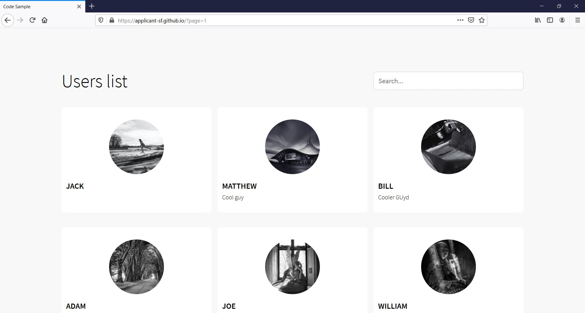

# Full Stack Code Sample

This repository is a code sample.

## Overview

I will host the FE for some time @ https://applicant-sf.github.io/. Please check it out!

Also check it out on mobile (still some kinks)! See images in `./res`.



## Projects

This repository is broken into two projects, `client` and `server`. Please consult their respective readmes for in-depth detail.

### Server

The server is a single AWS Lambda backed by dynamoDb. It provides the data API for the client. There are two major endpoints provided, a GraphQL endpoint for searching users, and a REST endpoint for geocoding addresses.

The deployment of the Lambda is run automatically - but manual configuration is required (at this time). See the server readme.

A summary of the services used by the backend - for more information about credentials, see the project readme.

```
Services:
- AWS Lambda
- AWS DynamoDB
- AWS API Gateway
- GCP Google Maps Geocoding API - https://github.com/googlemaps/google-maps-services-js


Credentials:
- AWS Access Key & Secret For Build Pipeline
- AWS Access Key & Secret For Lambda
- GCP Geocoding API Key
```


```
TODO:
-- Draw.io diagram or those neat "cloud services" diagrams the people make.
```

### Client

The client is a simple 'single page application'. It utilizes the BE and Google maps to provide an infinite scroll of users and the ability to edit users.

A summary of the services used by the front end - for more information about credentials, see the project readme.

```
Services:
- GCP Google Maps Javascript API
- Unsplash

Credentials:
- GCP Geocoding API Key
```

```
TODO:
-- Include picture (giphy?)
```