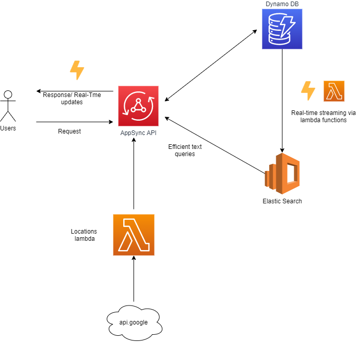

# Superformula Full Stack Developer Test
This document describes the overall architecture of the application, what was and what wasn't achieved so far, and also provides instructions on how to deploy it.

## Technologies used:
- Terraform
- AWS Lambda
- DynamoDB
- CloudWatch
- ElasticSearch
- React (typescript)
- NodeJS

## Backend

The backend architecture was built using AppSync, DynamoDB and Elastic Search for performant  full-text queries. An overview of the system can be seen in the diagram below:




In this system, a lambda function gets invoked every time a state-changing operation is performed against DynamoDB, ensuring the eventual consistency of both data sources. 

The system was designed to be **resilient to failures**, built with retry policies that re-send the same event to the lambda until it either gets successfully processed or a 6 hours timeout has passed without resolution. No further events are processed until either a fix is deployed or the timeout is reached, preventing the corruption of the ES instance due to out-of-order updates.

As to error handling, I was particularly keen on **avoiding silent failures as much as possible**, since those are the most dangerous ones due to data corruption and data loss (no retry logic nor alarms will kick in if the service keeps failing silently).

I used **Cloudwatch** to track failures, logs entries, executions, iterator lifetimes and other signals emitted by our services.

If we were to deploy this to production, I would add a CloudFront instance between users and `AppSync` due to its useful features (like request throttling, custom domains) for managing edge computing nodes.

### Data model

The following schema describes a user in the system

````graphql

type User {
    address: String!
    avatar: String!
    createdAt: AWSTimestamp!
    description: String!
    dob: AWSDate!
    id: ID!
    latitude: Float!
    longitude: Float!
    name: String!
    updatedAt: AWSTimestamp!
}

````

Values such as `updatedAt` and `createdAt` are set on the resolver using `VTL` before dispatching data to the server.

### Elastic Search Cluster Integration
Amazon Elastic Search is a service that provides efficient full text searching capabilities, empowering users to find what they want quicker, not only due to its scalability but also because the data returned tends to be more meaningful than a simple match.

Although relevant queries are nice, what really prompted me to go down this road was the fact that DynamoDB [limits datasets **before applying a filter**](https://docs.aws.amazon.com/amazondynamodb/latest/developerguide/Query.html), causing requests dispatched with filters to be resolved with a random number of items (2 responses in the first request, 4 in the next, 1 in the next and so on). With ElasticSearch, there is no such thing. We can expect responses to come in batches of 6, as requested in the documentation.

And also It was also great fun to setup this up and see what AWS had to offer on cloud-based architectures!

### Checklist - Basic requirements
- [x] Use **AWS AppSync (preferred)** or AWS Lambda + API Gateway approach
- [x] Use any AWS Database-as-a-Service persistence store. DynamoDB is preferred.
- [x] Write concise and clear commit messages
- [x] Write clear **documentation** on how it has been designed and how to run the code
- [x] Add a Query to fetch location information based off the user's address (use [NASA](https://api.nasa.gov/api.html) or [Mapbox](https://www.mapbox.com/api-documentation/) APIs); use AWS Lambda
  - Although it is worth noting the locations fetching on the backend was implemented using Google API. 
  - Mapbox was used to display locations on the front-end
  

### Checklist - Bonus
- [x] Use Infrastructure-as-code tooling that can be used to deploy all resources to an AWS account. Examples: CloudFormation / SAM, Terraform, Serverless Framework, etc.
  - All I can say about IaC is that I won't ever do it the old way again. Thanks for including this in the test! Special thanks to @afaq for talking about this amazing technology on the interview 
- [x] Provide proper unit tests
  - 100% Coverage achieved on the Google API Lambdas
- [ ] Providing an online demo is welcomed, but not required
  - Still working on the front-end, but the backend is ready to be tested as you wish!
- [x] Delete user functionality
- [x] Bundle npm modules into your Lambdas


### Preparing your environment for deployment

Before you deploy the project, make sure you check have your environment has been properly setup:

1. Download and install the AWS CLI on your machine
1. Log in to an account on the AWS CLI
1. Download ``serverless`` framework to generate the Lambda packages that will be deployed to AWS
   1. ``npm update -g serverless``
   1. You can also check if you have it installed by running the command ``serverless -v``
1. Install all required dependencies by running the following commands from root of the project:
    1. ``cd backend/lamdas``
    1. ``npm i`` to install the dependencies and then run ``serverless package`` 
    1. ``cd ../infra`` and ``terraform get``
    1. Fill the following tfvars
        1. ``gmaps_key`` - Your keys to the google maps API
  

NOTE: This deployment takes a while if you are doing it for the first time, because of the creation of the Elastic Service instance.


  
## Technical debts

- Improve AWS typing in the `elasticWriter` component and avoid using private AWS SDK APIs
- All lambdas a packaged together for convenience. In a large scale project, the ideal situation would be to break the project down into multiple packages. 

## Front-end

I will give a brief summary here of what was accomplished because it is still under development.

- [x] The search functionality should perform real time filtering on client side data and API side data
    - Only API data is being filtered in real time.
- [x] List of users should be updated automatically after single user is updated
    - Subscriptions take care of that
- [x] Create modal from scratch - please don't use any library for it
    - Implemented using a Portal with ``React.DOM``
- [ ] Appear/Disappear of modal should be animated (feel free with choose how)
  
- [x] Infinite loading state should be saved in url query (pagination state should be present in URL query (eg ?page=1) to allow for behavior where the user can reload the page while still returning to their current scroll position)
    - Works as expected
    
- [ ] Provide E2E and unit tests (one component&view well tested is enough, no need to test every component/view)
    - E2E Coming soon. I have to finish the user creation screen

    

## How to run the project

1. Create a ``.env`` file with all variables described on ``.env.sample`` filled
    1. ``REACT_APP_APPSYNC_REGION`` - AWS Region of the AppSync instance you are trying to connect
    1. ``REACT_APP_APPSYNC_URL`` - URL of the AppSync instance you are trying to connect
    1. ``REACT_APP_APPSYNC_API_KEY`` - AppSync API KEY
    1. ``REACT_APP_MAPBOX_TOKEN`` - MapBox token to view maps in the app
    1. ``REACT_APP_MAPBOX_STYLE`` - Link for the style you wish to use to display the maps on the app
1. run ``yarn install``
1. run ``yarn start``