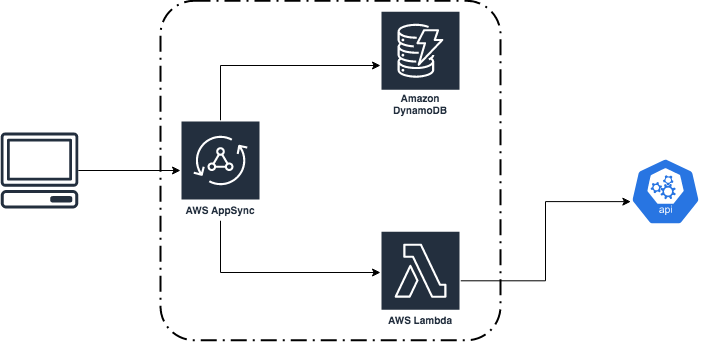

# Superformula FS API

This is a Graphql api hosted and managed on AWS AppSync, using a Lambda function to consume the MapBox API.

## Application Design

The applications was developed using:

- AppSync
- Lambda
- DynamoDB

**AppSync**: Handles all requests from the clients. It's a Graphql api capable of _create/read/update/delete_ Users from the database, and also, get location information from the lamdba function.

**Lambda**: One function responsible for consuming the MapBox API, it gets the arguments from AppSync and returns the geometry for the location.

**Dynamodb**: Managed document database responsible for storing all users informations.



### DynamoDB Table

The application uses a single table with a simple simple pk with the user id, which is auto generated, and the following Global Secondary Indexes:

- **name-index**: Simple key on name, to allow filtering by the name;
- **address-index**: Simple key on address, to allow filtering by the address;

Currently, the search by name on the User table is done by a scan and filter operation, which is not great for big tables, but it was a quick solution for the problem.

### Infrastructure

All the infrastructure was developed on the Serverless framework. The **serverless-appsync** plugin is being used to help with the AppSync resources. Besides that, there are others plugins being used:

- **serverless-plugin-typescript** to enable out-of-the-box typescript development
- **serverless-dynamodb-local** and **serverless-appsync-offline** to enable local development.

## Development

### Environment variables

All environment variables needed for development and deployments are described in the `.env.development` file. You just need to copy this file, without the `.development` on the name and populate the values.

### AppSync

The graphql schema is defined in the `schema.graphql` file.

All the mappings for the API are described in the serverless file and developed in the `mapping-templates/` folder. Most of the mappings are very straightforward, with the exception of the `mapping-templates/updateUser.request.vtl`, that builds dynamically the update expression based on the arguments.

### Lambda

The lambda code is splited between a few components:

- **src/config**: Stores all default configs for the project and also all environment variables used in the code, like the mapbox token;
- **src/controllers**: Works middle layer between the handler and the services;
- **src/errors**: All errors classes definitions. It helps with proper error handling;
- **src/interfaces**: All typescript interfaces definitions. They help to understand the inputs and outputs for each function
- **src/services**: The implementation of the services responsible for external interactions, like the mapbox api consumption.
- **src/utls**: Utilities functions, like the logger.

### Serverless

#### Local development

To run the application locally for testing, you just need to run

```
npm start
```

It automatically exports the environment variables and starts the serverless-appsync-offline listener

#### Deployment

To deploy the application you just need to run

```
npm run deploy
```

It will automatically export the env variables and deploy the infrastructure to the default `dev` stage.

To deploy on a different stage you can add the `-- --stage=<stage>` flag.

### Testing

Because of the time constraints I didn't write unit tests for the lambda function.

My approach to write tests for this project would be:

#### Mapbox service

- Write unit tests for the fetchLocation function, mocking the api calls using axios-mock.
  - Write tests for the success scenarios to guarantee the correct returns of the function;
  - Write tests for the api errors scenarios, exploring all the possible error responses, like 401, 403, 404 and 422, to make sure the function is handling the errors properly;
  - Write tests for the service errors, like 500 and 504;

#### Utils

- Write unit tests for the logger class, to make sure it is using the correct settings and logging correctly the different levels

## Final Thoughts

Despite the fact that I had never worked with AppSync before, I choose to develop on it so I could show that I can quickly learn a new technology and develop a solution on it.

My effort, while working on this, was to show my development skills and practices for good quality software development. I hope that I managed to do that on this project.
