### **Setting up AWS credential for the Docker Container (OPTIONAL)**

The following instruction assumes that you have this branch checkout already. Let's pretend the path of this branch is C:\Homework\test-full-stack on a Windows machine.  You will need to go the "docker" folder
    
   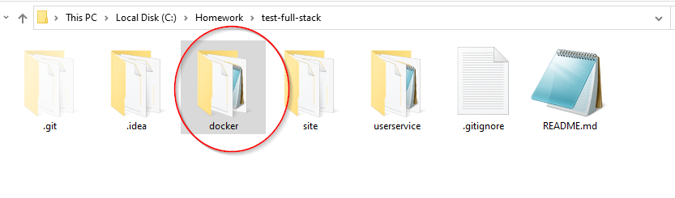
                                                                                                                                          
 1. Go to the AWS folder and make a copy of config.dev and
    credential.dev.    
    
    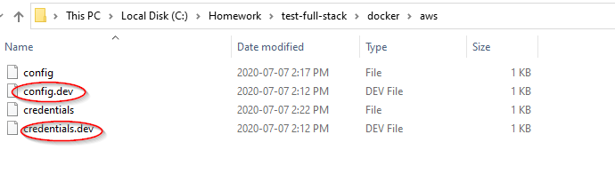
        
 2. Remove the .dev extension so the files will just be config and
    credential
    
    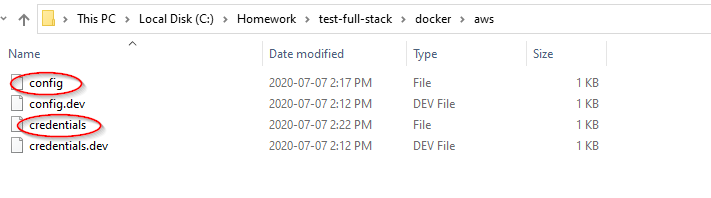
       
 3. Put in the AWS region you want in config
 
    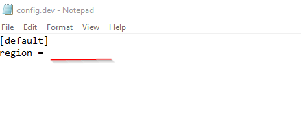
     
 4. Put in the aws_access_key and aws_access _secret in the credential
    files.
    
    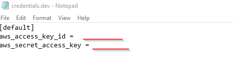
    
    		
###  **Getting ready to run Docker**


1. Go to the docker folder under this project.
   
2. Open the scripts folder.

   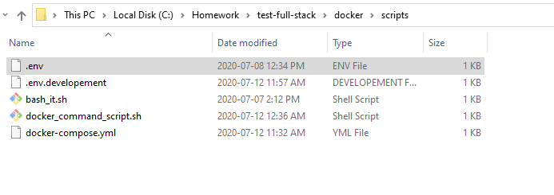
       
3. Make a copy of .env.developement and remove the .development so the file will just be .env

   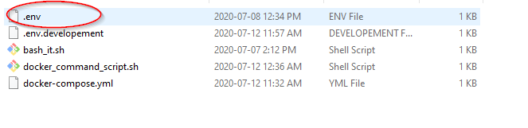
     
4. Put in the current project directory path to LOCAL_PROJECT_PATH. In the example we are in C:\Homework\test-full-stack.
  
   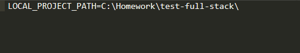 
   
   EXAMPLE ONLY !!!! please put in the correct path on where this branch sits in your computer.    
   
1. Open shell/command line on your computer and go to the following path.

   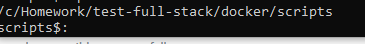
   
5. Now type in `docker-compose up` and…crosses finger everything will run smoothly, This might take a couple of minutes.  If it does your service deployment environment is set up, yay !!!!!!!!
  
   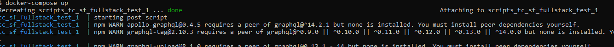
   

### Execute an interactive bash shell on the container.

1. Open shell/command line on your computer and go to the following path.

   
``   
3. Run `./bash_it.sh `
4. You should be in the bash shell on the container and be in the app directory.

   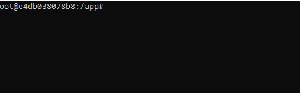
    
5. Go to tc_sf_fullstack_test, this will be the directory that contains the project code within the container.

   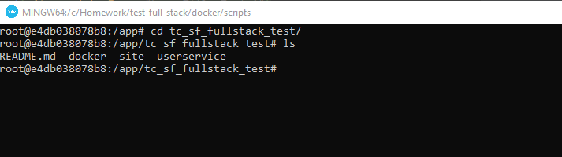 


### Other Tibits

This is pretty much the DockerFile

```
FROM node:12.18.2

# installing aws cli
RUN apt-get update -y
RUN apt-get install groff -y
RUN curl "https://awscli.amazonaws.com/awscli-exe-linux-x86_64.zip" -o "awscliv2.zip"
RUN unzip awscliv2.zip
RUN ./aws/install

# installing jest
RUN npm install -g jest

# installing serverless
RUN npm install -g serverless

RUN apt-get install default-jre -y
```


Docker compose file

```
version: '3.7'
services:
  tc_sf_fullstack_test:
    build:
      context: ../
      dockerfile: Dockerfile
    image: tc_sf_fullstack_test:1.0
    working_dir: /app
    volumes:
      - ${LOCAL_PROJECT_PATH}:/app/tc_sf_fullstack_test/
    command: /bin/bash /app/tc_sf_fullstack_test/docker/scripts/docker_command_script.sh
```

