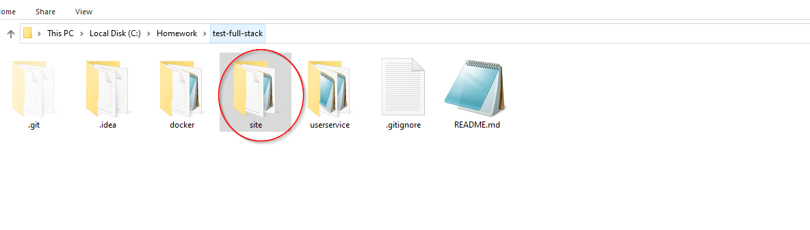
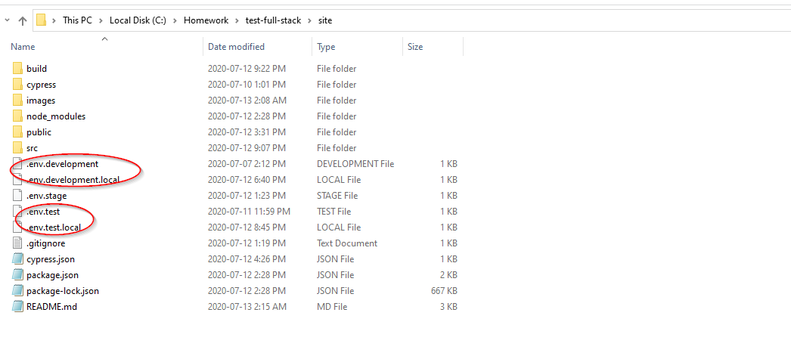
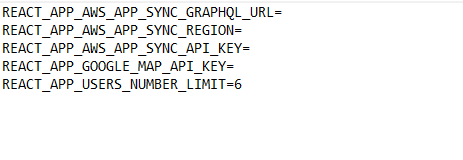
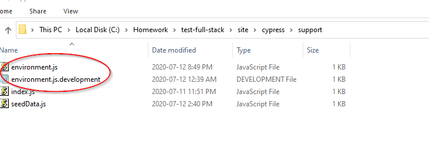
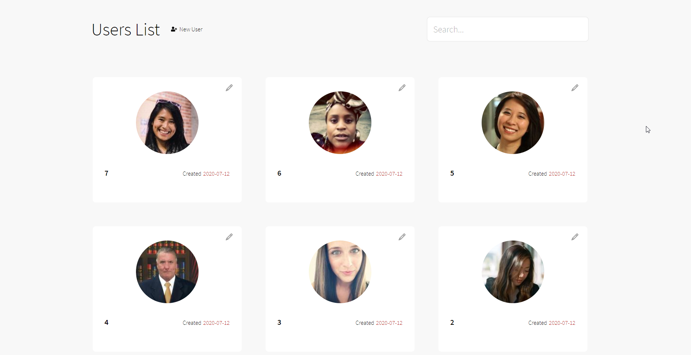
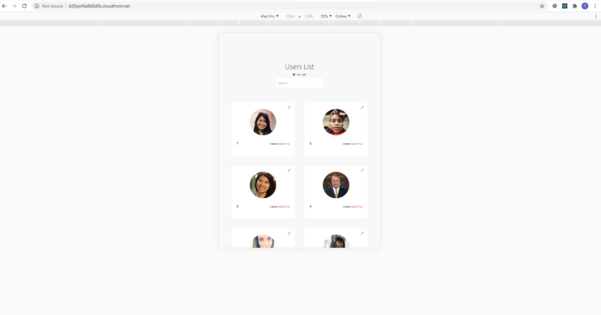
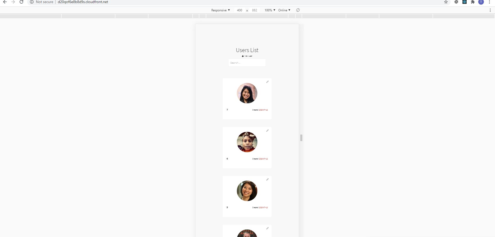

### Setting up the site project

The following instruction assumes that you have this branch checkout already. Let's pretend the path of this branch is C:\Homework\test-full-stack on a Windows machine.  You will need to go the "site" folder

2. Make a copy of .env.test and .env.developement and add the .local extension. So these two files should be call env.test.local and .env.development.local.

3. Add in the userservice e2e test credential to the .env.test.local file and the userservice dev credential for .env.development.local. You will need to put in a Google API key to these two files.

 
4. Go to the cypress/support folder and make a copy of the environment.js.development. Rename that to just environment.js.

5. Put in the userservice e2e test credential to the environment.js file 

6. Run `npm i`

### Running the sites

1. To run the site use `npm start`
2. To run the e2e test site use `npm run start_test_site`

### Running the test

1. To run the unit test use `npm test`
2. To run the e2e test use `npm run cypress:open`

 

### Other Tibits

The user list is sorted by descending order. Adding a user will always put the user right at the beginning. That means if another client adds a user you will see what they added right at the beginning.   Anytime a user is added/deleted/updated there will be a toast notification.  

The e2e test is not 100% stable I would say.  Especially the test that simulate another client adding/updating/deleting a user and those result showing up on your screen. However, they do work for me on my machine (heh the famous word from a developer).  Here is a short video showing the e2e test in action running locally.  But I do notice from time to time it fails and it looks like cypress is grabbing on to the old elements and blocking the subscription from finishing.

[Video](https://cdn.vidyard.com/videos/QOqTvRwk-KC__ljkzO8AdA/hd.mp4?K8VFt9OabVW-AwLOOzvX0TjH-Qa5sSgP16NdSWIy2IIhd988ng0IgEbjxFL2rbrqkQgEUQlv3VDU9QiNG1qO8TIOGBNDpTqL5LAJ6Kve)

The site should be responsive, tested this on chrome 83, and here are some screenshots.

Desktop

Mobile

Mobile

The load more button only appears when the current number of items on screen % 6 (this number can be controlled in the env file) == 0, except when is 0.  Since WebSocket is involved any other time another client adds a user, you should be getting an update too.  So might look odd once you click it and see it disappear.  But should not get into a stuck state.       
