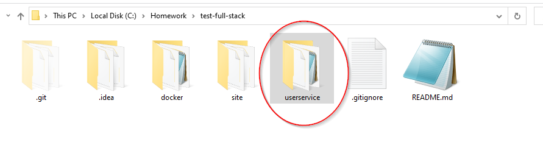
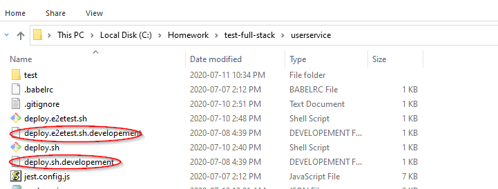
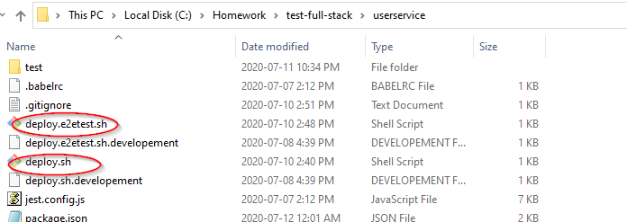
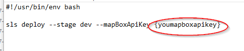
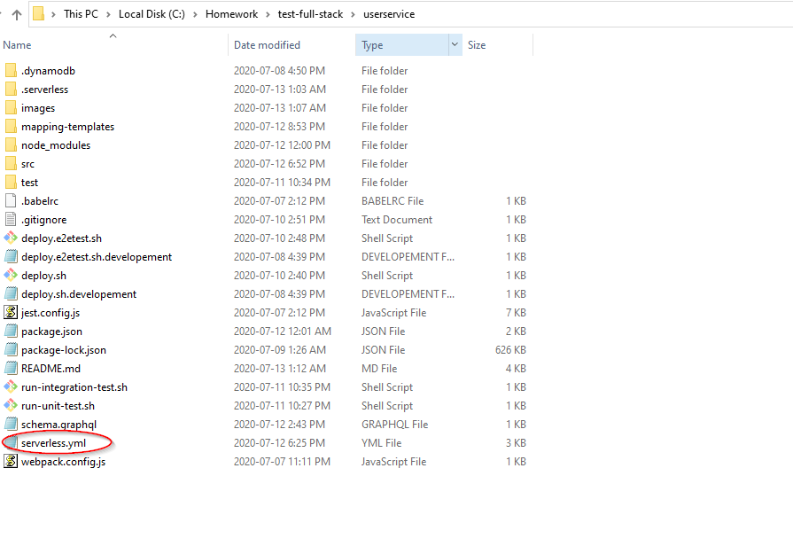
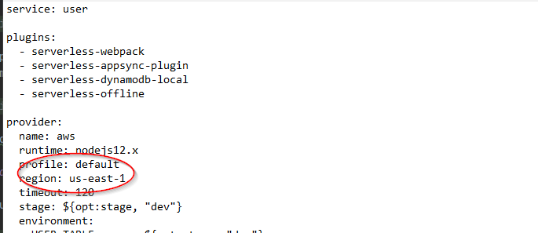
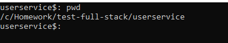
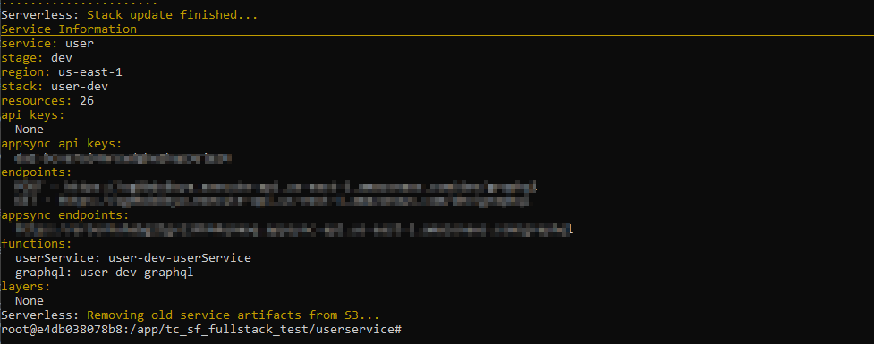
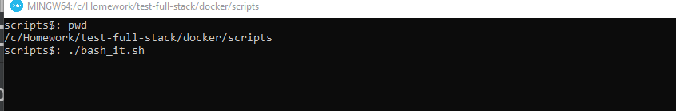
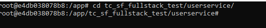

The following instruction assumes that you have this branch checkout already. Let's pretend the path of this branch is C:\Homework\test-full-stack on a Windows machine.  

### Setting up the userservice project

1. Go to the project's "userservice" folder

                      

2. Make a copy of both deploy.sh.developement and deploy.e2etest.sh.development 

3. Rename those copy by removing development so it will just be deploy.sh and deploy.e2etest.sh

4. Edit both those files and put your mapbox API token on {youmapboxapikey} in those files.

# Deploying the userservice to AWS

### The following instruction is for your local environment

1. Find the serverless.yml file, should be here.

2. Change the region and the AWS profile you wish to use

3. Open a shell/command line and navigate to the userservice folder.  

4. Execute `npm i`, `npm install -g serverless`, and `sls dynamodb install`.   

5. Execute `./deploy.sh` or `npm run deploy_dev` and this will deploy the dev version. This will be the service where you will use the site to interact and play with.
6. Execute `./deploy.e2etest.sh` or `npm run deploy_e2e` and this will deploy the e2e version. This will be the service where cypress will run against.

Grab the appsync API keys and appsync endpoints.  You will need this for the front-end portion.

### The following instruction is for the Docker Version

1. Enter the bash shell of the container.
   

2. Go the useservice folder "cd tc_sf_fullstack_test/userservice/"

4. Execute `./deploy.sh` or `npm run deploy_dev` and this will deploy the dev version. This will be the service where you will use the site to interact and play with.
5. Execute `./deploy.e2etest.sh` or `npm run deploy_e2e` and this will deploy the e2e version. This will be the service where cypress will run against.

Grab the appsync API keys and appsync endpoints.  You will need this for the front-end portion.

### Running unit test

1. To run unit test simply execute `./run_unit_test.sh` or `npm run unit-test` 

### Running integration test

2. Execute `sls dynamodb start --stage=test`
3. Open another shell/command line and navigate back to the userservice folder and execute `./run-integration-test.sh` or `npm run integration-test`

### Project Structure

1. mapping-templates
   - contains all the vtl resolver files.
2. src (This is where all the logic sits. This borrows ideas from the onion core architect.)   

    1. compositeRoot
        - helper function that brings the classes together. (Poor man’s DI)
        
    2. error
        - custom UserServiceError and a logFunction. Will log UserServiceError as warnings
        
    3. graphql
        -  graphQL handler for the requirement to return back location information base on a user
        
    4. lambda
        - All the handlers for the crud logic. AppSync graphQL calls will pretty much get resolve and call into these lambda functions.
        
    5. Model
        - The domain model for the userservice. 
        
    6. Repository
        -  This is the infrastructure layer (data access layer). 
        
    7. Service
        -  The service layer, basically the business logic for the userservice. Since this is crud, is mostly used for validation and calling into the repository layer.
    
3. Test
    - Where all the test sits
4. Other files to pay attention to in the main directory
    - serverless.yml
    - schema.graphql

### AppSync Flow I am going for

I am pretty much using the AppSync resolver to call into a Lambda function to do the heavy lifting.  

### Other Tibits

Regarding the docker image that I build the intention was to have an environment where I can deploy to AWS, run tests, and run the service via serverless offline. But I was not able to get serverless-appsync-offline plug-in to work. Can’t get it to work in docker or my local machine (however serverless-offline plug-in works very nicely).  Ran into a java error and pretty much abandon that idea.  So I just keep the image around for straight deployment reason and to run integration test and unit test against. 